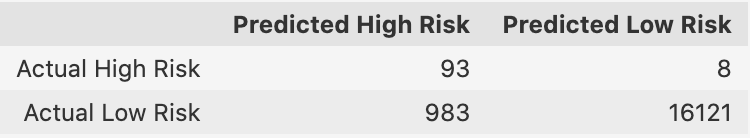

# Credit_Risk_Analysis

## Overview
### Purpose
Using data from LendingClub ([LoanStats_2019Q1.csv.zip](LoanStats_2019Q1.csv.zip)), the goal of this analysis is to use various machine learning algorithms to predict credit risk, compare the accuracy of the algorithms, and to determine which algorithm, if any, can be used to predict credit risk.

### Process
Because credit risk is an inherently unbalanced classification problem we will need to use oversampling, undersampling, or a combination approach to try to more accurately assess risk using a Logarithmic Regression model of classifying data. Then, we will use two ensemble classifiers to see if either of those produces a more accurate result.

### Code
The full code for this analysis can be found at [credit_risk_resampling.ipynb](credit_risk_resampling.ipynb) and [credit_risk_ensemble.ipynb](credit_risk_ensemble.ipynb).

## Results

- Oversampling with ```RandomOverSampler``` has a balanced accuracy score of 0.64... 

... with a precision of 0.01 and a recall of 0.66.

- Oversampling with ```SMOTE``` has a balanced accuracy score of 0.66...
 
... with a precision of 0.01 and recall of 0.62.

- Undersampling with ```ClusterCentroids``` has a balanced accuracy score of 0.54...
 
... with a precision of 0.01 and recall of 0.69.

- Over- and Undersampling with ```SMOTEENN``` has a balanced accuracy score of 0.67...
 
... with a precision of 0.01 and recall of 0.79.

- Ensemble Classification with ```BalancedRandomForestClassifier``` has a balanced accuracy score of 0.79...
 
... with a precision of 0.03 and recall of 0.70.

- Ensemble Classification with ```EasyEnsembleClassifier``` has a balanced accuracy score of 0.93... 

...with a precision of 0.09 and recall of 0.92.


### Table of Accuracy, Precision, & Recall
| Sampling Technique/ML Algorithm | Balanced Accuracy Score | Precision | Recall | Confusion Matrix |
| :--- | :---: | :---: | :---: | :---: |
| ```RandomOverSampler```| 0.64 | 0.01 | 0.66 |  |
| ```SMOTE``` | 0.66 | 0.01 | 0.62 |  |
| ```ClusterCentroids``` | 0.54 | 0.01 | 0.69 |  |
| ```SMOTEENN``` | 0.67 | 0.01 | 0.79 |  |
| ```BalancedRandomForestClassifier``` | 0.79 | 0.03 | 0.70 |  |
| ```EasyEnsembleClassifier``` | 0.93 | 0.09 | 0.92 |  |

## Summary

### Which model outperformed the rest?
The model that performed the best with the highest Balanced Accuracy Score, Precision, AND Recall is the ```EasyEnsembleClassifier```. This model has a recall of 0.92, meaning that it will correctly predict a high risk credit application 93% of the time. With the test data, the model correctly predicted 93 high risk credit applications, only missing 8 high risk credit applications that the model classified as low risk.  

This model has a precision of 0.09, because out of 1076 predicted high risk credit applications, only 93 were truly high risk. In other words, the model correctly predicts a high risk credit application only 9% of the time. 

### Recommendation
Because the best model we tested only has a precision of 9%, this means that a bank who used this model would be turning down 91 credit applications that are really low risk for every 9 credit applications that are truly high risk and should be turned down. This would be likely to make a big impact on the bank's revenue, since its revenue comes primarily from loan interest. Thus, I recommend that none of the above models be used to predict credit risk.